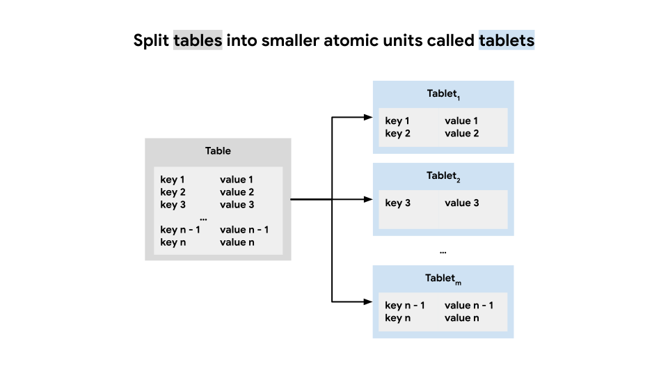
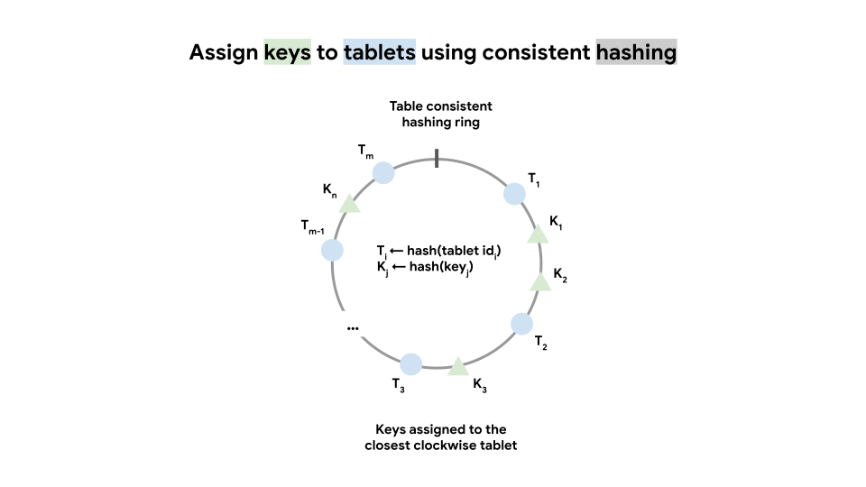
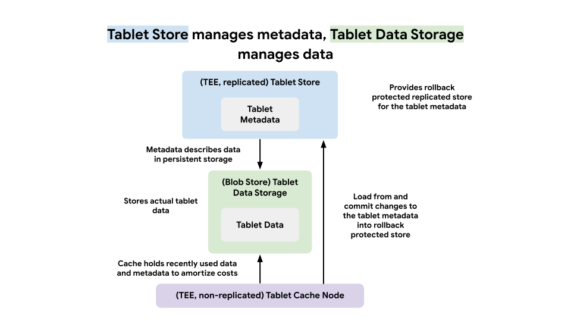
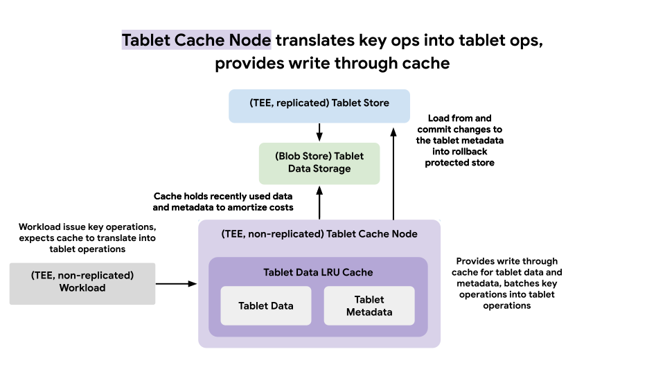

# Motivation

We would like to address the question of how to enable massive scale trusted computations tracking privacy budgets. One (but not the only) way to achieve this is by storing privacy budgets in a key value store. This document describes how to build a scalable key value store with rollback and forking protection. This is achieved through the replicated state machines on top Raft consensus protocol running inside of the TEEs with extensions to safeguard against rollback, forking, and replaying attacks.

# Interface

We start by formulating a simple interface for the key value store in terms of the following operations (we will explore separately how to enable transactions across multiple operations):

* **get(key) → option\<value\>** Get value associated with the key or nothing if the key is not present.
* **put(key, value, predicate) → bool** Puts new value for the given key if the predicate evaluates to true for the old value.

Replicated state machines (provided by the [Trusted Computations Platform](https://github.com/google-parfait/trusted-computations-platform)) are a great building block for key value stores (operations are expressed as replicated log entries). However, the massive scale poses significant challenges and straightforward solutions will not work. In order to make a production ready system we need to apply several principles that we further explore.

# Principles

We apply the following principles to enable desirable scale while keeping the resource consumption reasonable:

* **State and computation offload.** It is not feasible to either hold or process the entire state in a replicated state machine. At scale, cost factors escalate significantly, including memory demands for state storage, network bandwidth required for replication and state snapshot distribution, computational requirements for data processing and privacy mechanisms, and the potential impact of failure recovery time. Therefore the replicated state machine must manage the minimum required state and perform minimum processing (manage metadata) and offload the rest (storage and processing). State persistence must be offloaded to a persistent blob storage where the data is encrypted at rest (trading expensive memory for cheap persistent blob storage). State processing must be offloaded to stateless elastically scalable service (trading strict serial execution for relaxed parallel execution).
* **Coarse reads and writes.** With state and processing offloading, fine reads and writes incur high persistent blob storage overhead (lots of small blob reads and writes) as well as privacy overhead (remote attestation and encryption). The coarse reads and writes are crucial for the cost amortization. Therefore data is organized into batches that are processed as an atomic unit, thus reducing overhead associated with the number of stored blobs and the privacy state maintained by the replicated state machine.
* **Batch requests with write through cache.** Coarse reads and writes address scalability challenges however pose inconvenience for the applications. To enable the fine interface outlined earlier while maintaining coarse reads and writes profile we need to introduce requests batching with write-through cache. Requests batching serves as a bridge between fine and coarse interface while write through cache further amortizes the costs. Note that individual request latency is traded (increased) for the overall throughput (increased). Coarse operations lessen the load on the replicated state machine that are prohibitively expensive for the fine operations.
* **Replicated rollback protected metadata store.** The data storage is offloaded to the persistent blob storage, however it must be protected from rollback (e.g. replaced with stale version). Therefore the replicated state machine running inside of the TEEs provides a rollback protected replicated store that maintains metadata for the data batches (that includes data summary, encryption, integrity and persistence information). Specifically data batch is considered updated only after metadata update is committed to the metadata store. Metadata store leverages optimistic concurrency and implements serializable transactions required for privacy scenarios.

In the sections that follow we explore several mechanisms that jointly implement the described above principles.

# Overview

This section provides a very high level description of how principles described above are applied. Key value data is organized into tables where each table is broken into small units called tablets. Replicated Tablet Store with rollback protection running inside of TEEs manages tablet metadata that describes actual tablet data stored in the Tablet Data Storage implemented on top of persistent blob store. Tablet concept enables coarse interface. Tablet Cache enables the fine interface we introduce and acts as a write-through cache for batched fine operations.

The following sections elaborate details and tie it all together in a system architecture.

# Model

Key-value pairs are organized into tables. Tables are partitioned into smaller units called tablets (data batches), based on the key. Each table possesses a unique partitioning configuration (initial number of tablets, desirable tablet size), which is determined by factors such as data distribution, size and anticipated usage.

*Figure 1\. Table partitioning into smaller atomic units called tablets. Table partitioning is done via consistent hashing though range partitioning is also possible.*

Tables are partitioned using a [consistent hashing](https://en.wikipedia.org/wiki/Consistent_hashing) algorithm. In accordance with the partitioning configuration, the system initially generates a set of empty tablets. Each tablet is assigned a unique, randomly generated identifier to ensure balanced load distribution across tablets. These identifiers are then positioned on a consistent hashing ring. Keys are assigned to tablets by applying a hash function to the keys (which are treated as opaque byte strings) and identifying the closest tablet identifier in a clockwise direction on the consistent hashing ring. Tablets can be added or removed to maintain balance, and in such cases, the affected keys are reassigned to the new set of tablets.

*Figure 2\. Key to tablet assignment using consistent hashing.*

A tablet is composed of metadata and data. Tablet metadata comprises a unique tablet id,  a monotonic version (for concurrency), an encryption key (for data encryption at rest), on-disk size (for rebalancing), a hash (for integrity), and a reference to the persistent storage (for processing). Tablet data is an encrypted serialized set of key-value pairs.

# Transactions

Get and put operations are executed against tablets that correspond to the operation keys. Get and put operations against the same tablet are grouped together and executed atomically. Multiple tablets can be updated in a single transaction.

Transactions provide a serializable isolation level, such that with concurrent transaction execution, the outcome remains identical to a sequential execution without concurrency. This approach prevents "anomalies" associated with weaker isolation levels, preserving correctness. The strict guarantees provided by serializable isolation are essential for enabling privacy mechanisms.

To implement transactions we use multi version concurrency control. Once created, tablets are immutable. When a tablet is updated a new version of the tablet metadata and data is created. Transaction consists of preparation and commit stages. During the preparation phase an updated tablet data (new version) is persisted in the storage and updated metadata computed. During the commit phase the updated metadata (new version) is committed to the replicated metadata store. If tablet version conflict is detected the transaction is rolled back. This describes a transaction for a single tablet (special case transaction composed out of a single update action), however multiple tablets can be updated in a single transaction by combining multiple actions.

Overall the following actions for the tablets are supported by the replicated metadata store:

* **list(predicate) → list\<metadata\>** Lists tablets. Returns metadata or tombstones of the tablets that satisfy a given predicate.
* **remove(id, version)** Removes existing tablet. Does nothing if a tablet with a given id does not exist. Otherwise creates a tombstone object and increments the tablet version.
* **add(metadata)** Adds new tablet. Fails if either a tablet with a given id already exists or the version of an existing tombstone doesn't match. Otherwise removes an existing tombstone and increments the tablet version.
* **update(metadata)** Updates existing tablet. Fails if a tablet with a given id doesn't exist or the tablet version doesn't match. Otherwise replaces tablet metadata and increments the tablet version.

Transactions that are composed of several actions are executed in an atomic manner upon successful commitment to the replicated transaction log. If there is a conflict with a previously committed transaction (i.e., any of the affected tablets have changed their version since the transaction was initiated), the transaction is terminated; otherwise, it is considered committed. Transactions may span across multiple tablets (potentially from different tables), thus enabling whole dataset updates.

# Storage

Tablet data is stored in a persistent blob store. Tablet metadata maintains references to the storage locations of tablet data. Consequently, to avert data loss, tablet data must be retained as long as it is referenced. When a new version of a tablet is generated (added or updated), the tablet data is initially recorded in the storage and subsequently tablet metadata update is committed. When an existing tablet is to be eliminated, its metadata must be deleted first, and then the tablet data can be removed from the storage.

Immutable tablet data enables optimizations for the on-disk format, leading to efficient storage (where compression can be applied), loading (where only pertinent key-value pairs must be deserialized), and processing (where materialized aggregates may be leveraged). For instance, data queried by range may be formatted as SSTables, while columnar-oriented data may be formatted as Parquet. The format of the table data can be customized to suit the specific application.

Due to privacy requirements, tablet data must remain encrypted at rest. The corresponding encryption key resides in tablet metadata.

# Cache

Tablet data is stored in a persistent blob store and tablet metadata is stored in replicated metadata storage. A tablet update results in read of tablet metadata from replicated metadata store, then original tablet data from persistent blob store with decryption and integrity checking, followed by write of updated tablet data into persistent blob store and finishing with updated tablet metadata written to replicated metadata store. This cost is split across a number of operations against that tablet.

In order to amortize the costs we introduce a write through cache for the tablet data and metadata. The write through cache performs two important functions:

* It caches the most recently used tablets data and metadata so that tablet updates, in the majority of cases, don't incur persistent blob store and replicated metadata store reads.
* It batches requests to perform fewer tablet updates and amortize per request costs.

In order to make cache hit rate high and hence achieve higher cost amortization the requests routing must be cache aware. In other words, requests are routed such that with high probability the destination cache node will have tablet data and metadata cached. Ideally, in steady state any given tablet data and metadata is processed by a single cache node.

# Architecture

In this section we discuss the overall key value store architecture with the above mechanisms applied. The system consists of services that are both fault tolerant and independently scalable.

* **Tablet Store** Replicated key-value store with rollback, forking and replay protections running inside of the TEEs. Provides storage and transactional management for the tablet metadata.
* **Tablet Cache** Write through cache for tablet data and metadata running inside of the TEEs. Provides requests batching and cost amortization for tablet updates.
* **Tablet Data Storage** Persistent blob store that is responsible for the tablet data storage.

## Tablet Store

Tablet Store is a replicated rollback protected computation running on top of Trusted Computations Platform. Tablet Store represents the root of trust for the private data that is being stored in the tablets. Therefore Tablet Store is the provider of the chain of trust attestation and holder of the encryption keys for the private data.

*Figure 3\. Tablet Store manages tablet metadata, Tablet Data Storage manages tablet data.*

Tablet Store interface is coarse and is expressed in terms of tablets. Tablet Store exposes essentially read (with snapshot isolation level) and write (with serializable isolation level) transactions. Tablet Store represents transactions as entries in the replicated log. Upon successful commitment of the transaction entry it is evaluated and if successful applied to the Tablet Store state.

## Tablet Cache

Tablet Cache is an ephemeral write through cache for the tablet data and metadata that also acts as a batching bridge between fine key level interface (comprising get and put key operations) and coarse tablet level interface (comprising read and write tablet transactions).

*Figure 3\. Tablet Cache Node translates key ops into tablet ops, provides write through cache.*

Tablet Cache exposes a fine key level interface. In order to make the cache hit rate high and the cost amortization effective the requests are routed based on the keys. Tablet Cache maintains in memory metadata of the assigned tablets. Upon arriving requests are associated with corresponding tablets via consistent hashing and tablet metadata. Tablet Cache attempts to execute batched requests as coarse tablet updates.

Tablet Cache maintains in memory tablet data and metadata that must be updated. If required tablet data is not present in memory, it is loaded from Tablet Data Storage and placed into an LRU cache (potentially evicting another tablet if the size of the cache goes above configured threshold). When executing a tablet update Tablet Cache first writes a new version of the tablet data into Tablet Data Storage and internal LRU cache, then tries to commit tablet metadata update into the Tablet Store. Depending on the outcome either the old (success) or new (failure) version of the tablet data is evicted and the corresponding blob in Tablet Data Storage is deleted.

Tablet Cache is also tasked with performing periodic maintenance of the tablets. Overtime tablets may grow or shrink beyond the desirable threshold specified by table configuration or have orphaned tablet data in Tablet Data Storage. Tablets that are adjacent on the consistent hashing ring and jointly smaller than table specified threshold are merged together. One tablet is selected as a receiver where all data from donor tablets is inserted, then the receiver tablet is updated and donor tablets are removed in a single transaction. Tablets that are larger than the table specified threshold are split into multiple tablets. The data from the donor table is inserted into a newly created set of receiver tablets, then the donor tablet is updated and receiver tablets are added in a single transaction.

Tablet Cache is ephemeral and doesn't affect the correctness of the system. Therefore Tablet Cache nodes are not replicated and upon restart recover the set of assigned tablets from the Tablet Store whereas internal cache is populated as requests come in.

Tablet Cache maintains a secure channel with the Tablet Store. Secure channel handshake includes mutual attestation and end to end encryption.

## Tablet Data Store

Tablet Data Store is implemented on top of a persistent blob store where each tablet data is represented by a separate blob. Blob sizes are intended to be within a reasonable margin of configured size. The maintenance procedure that Tablet Cache performs continuously tries to maintain this property.
